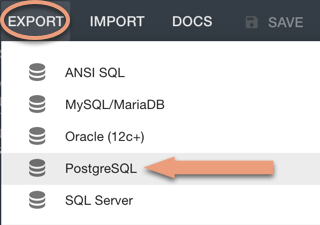

## Designing an ERD

In this assignment, you will work through the following scenario:

You are meeting with a gym owner who wants to organize his data in a database. Create a data model for the gym owner.

In addition, transition your logical ERD created in the previous activity to a physical ERD.

### Instructions

* Create an ERD by determining the entities that will be present in the database, along with their attributes. Include the following: `trainers`, `members`, `gym`, and `payments`.

* Create a diagram using the [Quick Database Diagrams](https://app.quickdatabasediagrams.com/#/) tool.

* When you are satisfied with the conceptual diagram, update it to a logical ERD by including column data types and primary keys. Then transition your logical ERD physical ERD by creating the relationships between tables.

**Hint:** Read this [documentation](https://www.visual-paradigm.com/support/documents/vpuserguide/3563/3564/85378_conceptual,l.html) for more in-depth explanations of entity relationship diagrams.

* When you are satisfied with your ERD, export the diagram as a PostgreSQL file to forward-engineer your database:

  * In the Quick Database Diagrams tool, click on the **Export** tab and select **PostgreSQL** from the drop-down menu.

    

  * A file named `QuickDBD-export.sql` will appear in your Downloads folder.

* In pgAdmin, connect to your server and create a new database named `gym`. Then open a query tool.

* Open the file you downloaded. Paste the code in pgAdmin, and then execute the code.

### Hints

* Foreign keys are added to each table represented by the `FK` acronym, followed by the relationship, e.g., `OrderID INT FK >- Order.OrderID`.

* You will need to add foreign keys to your tables in order to map the data relationships.

* Remember to document the relationships between entities using the correct symbols. Here are the allowed relationship types:

  

* Keep in mind the following:

  * Each member belongs to only one gym.
  * Trainers work for only one gym, but a gym has many trainers.
  * Each member must have a trainer, but each trainer may instruct multiple members.
  * Each member has one credit card on file.

* Once the exported code has been used to create tables using pgAdmin, you can check the table creation with the following syntax (note the quotations around the table name):

  ```sql
  SELECT * FROM "Members";
  ```
