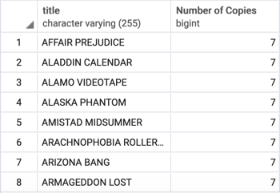

## A View with a Roomful of Queries

Utilize your join and subquery skills and also build out a view.

### Instructions

* Use the `rental_db` that was created during exercise 1 on day 9.2
* Write a query to get the number of copies of a film title that exist in the inventory. The results should look like those shown in the following image. Your challenge is to use a subquery (a query embedded within another query) instead of a join.

  

* Create a view named `title_count` from the above query.

* Query the newly created view to find all the titles that have 7 copies.
