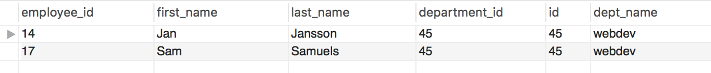

# Foreign Keys


* The following are a query and output involving two tables. Notice that `department_id` and `id` columns match.

  ```sql
  SELECT * FROM employees e
  JOIN departments d
  ON (e.department_id = d.id)
  WHERE e.department_id = 45;
  ```

  

* Based on the above, reconstruct the table schemata for `employees` and `departments` tables.

* _You can use pgAdmin and create a new table to test out this activity_
* _Save your completed SQL file in this folder._
